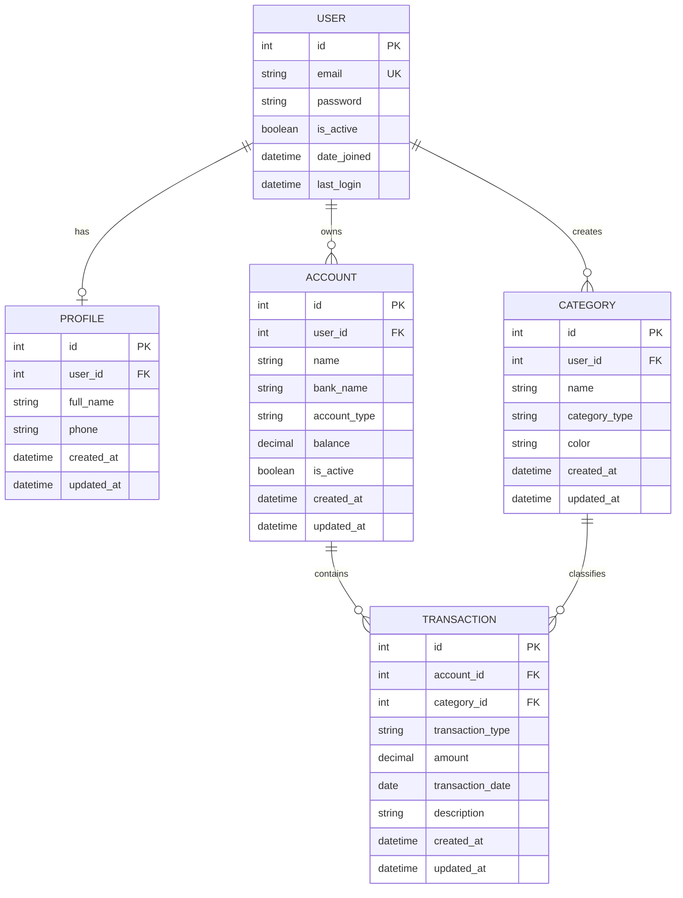

# Product Requirements Document (PRD) - Finanpy

## 1. Visão Geral

O Finanpy é um sistema de gestão de finanças pessoais desenvolvido com Python e Django, focado em simplicidade e eficiência. O projeto adota uma abordagem full-stack utilizando Django Template Language com TailwindCSS para o frontend, proporcionando uma experiência moderna e responsiva sem over-engineering.

## 2. Sobre o Produto

O Finanpy é uma aplicação web que permite aos usuários gerenciar suas finanças pessoais de forma intuitiva e organizada. O sistema oferece controle de contas bancárias, categorização de transações, visualização de entradas e saídas, e um dashboard centralizado para análise financeira. Com design moderno em tema escuro e gradientes harmônicos, o produto equilibra funcionalidade e estética.

## 3. Propósito

Fornecer uma ferramenta simples, eficiente e acessível para que pessoas possam organizar suas finanças pessoais, acompanhar receitas e despesas, categorizar transações e tomar decisões financeiras mais conscientes através de visualizações claras e objetivas.

## 4. Público Alvo

- **Perfil Primário**: Adultos entre 25-45 anos que buscam organizar suas finanças pessoais
- **Perfil Secundário**: Jovens profissionais iniciando sua independência financeira
- **Características Comuns**:
  - Possuem múltiplas contas bancárias
  - Necessitam controlar gastos mensais
  - Buscam simplicidade e praticidade
  - Têm acesso regular à internet
  - Preferem soluções diretas sem complexidade excessiva

## 5. Objetivos

### 5.1 Objetivos de Negócio
- Criar uma ferramenta MVP funcional de gestão financeira pessoal
- Estabelecer base de usuários engajados
- Demonstrar viabilidade técnica da solução

### 5.2 Objetivos de Produto
- Permitir cadastro e autenticação segura de usuários
- Possibilitar gerenciamento de múltiplas contas bancárias
- Facilitar registro e categorização de transações financeiras
- Fornecer visualização clara do panorama financeiro através de dashboard

### 5.3 Objetivos de Usuário
- Ter visão consolidada de todas as contas em um único lugar
- Categorizar e entender para onde o dinheiro está indo
- Controlar entradas e saídas de forma simples
- Acessar informações financeiras de forma rápida e intuitiva

## 6. Requisitos Funcionais

### 6.1 Autenticação e Usuários
- RF001: Sistema deve permitir cadastro de novos usuários com email e senha
- RF002: Sistema deve permitir login de usuários através do email
- RF003: Sistema deve permitir logout de usuários
- RF004: Sistema deve validar formato de email e força de senha
- RF005: Sistema deve impedir cadastro de emails duplicados

### 6.2 Gestão de Perfis
- RF006: Sistema deve criar perfil automaticamente ao cadastrar usuário
- RF007: Sistema deve permitir visualização de dados do perfil
- RF008: Sistema deve permitir edição de informações do perfil

### 6.3 Gestão de Contas Bancárias
- RF009: Sistema deve permitir cadastro de contas bancárias
- RF010: Sistema deve permitir listagem de todas as contas do usuário
- RF011: Sistema deve permitir edição de dados de contas
- RF012: Sistema deve permitir exclusão de contas
- RF013: Sistema deve exibir saldo atual de cada conta
- RF014: Sistema deve associar contas ao usuário logado

### 6.4 Gestão de Categorias
- RF015: Sistema deve permitir cadastro de categorias de transações
- RF016: Sistema deve permitir listagem de categorias do usuário
- RF017: Sistema deve permitir edição de categorias
- RF018: Sistema deve permitir exclusão de categorias
- RF019: Sistema deve diferenciar categorias de entrada e saída

### 6.5 Gestão de Transações
- RF020: Sistema deve permitir registro de transações de entrada
- RF021: Sistema deve permitir registro de transações de saída
- RF022: Sistema deve associar transação a uma conta bancária
- RF023: Sistema deve associar transação a uma categoria
- RF024: Sistema deve registrar data da transação
- RF025: Sistema deve permitir adicionar descrição à transação
- RF026: Sistema deve permitir listagem de transações do usuário
- RF027: Sistema deve permitir filtrar transações por período
- RF028: Sistema deve permitir filtrar transações por conta
- RF029: Sistema deve permitir filtrar transações por categoria
- RF030: Sistema deve permitir edição de transações
- RF031: Sistema deve permitir exclusão de transações

### 6.6 Dashboard
- RF032: Sistema deve exibir saldo total consolidado de todas as contas
- RF033: Sistema deve exibir total de entradas do período atual
- RF034: Sistema deve exibir total de saídas do período atual
- RF035: Sistema deve exibir balanço (entradas - saídas) do período
- RF036: Sistema deve exibir lista de transações recentes
- RF037: Sistema deve exibir resumo por categorias

### 6.7 Site Público
- RF038: Sistema deve ter página inicial pública de apresentação
- RF039: Página inicial deve ter botão de cadastro
- RF040: Página inicial deve ter botão de login
- RF041: Usuários não autenticados devem ser redirecionados ao site público
- RF042: Usuários autenticados devem ser redirecionados ao dashboard

### 6.2 Flowchart - Fluxos de UX

```mermaid
flowchart TD
    Start([Usuário acessa site]) --> CheckAuth{Usuário<br/>autenticado?}
    
    CheckAuth -->|Não| PublicHome[Página Inicial Pública]
    CheckAuth -->|Sim| Dashboard[Dashboard]
    
    PublicHome --> ActionChoice{Escolhe ação}
    ActionChoice -->|Cadastrar| RegisterForm[Formulário de Cadastro]
    ActionChoice -->|Login| LoginForm[Formulário de Login]
    
    RegisterForm --> ValidateReg{Dados<br/>válidos?}
    ValidateReg -->|Não| RegisterForm
    ValidateReg -->|Sim| CreateUser[Criar Usuário e Perfil]
    CreateUser --> AutoLogin[Login Automático]
    AutoLogin --> Dashboard
    
    LoginForm --> ValidateLogin{Credenciais<br/>válidas?}
    ValidateLogin -->|Não| LoginForm
    ValidateLogin -->|Sim| Dashboard
    
    Dashboard --> DashActions{Ação no Dashboard}
    
    DashActions -->|Gerenciar Contas| AccountsList[Lista de Contas]
    AccountsList --> AccActions{Ação}
    AccActions -->|Criar| CreateAccount[Criar Conta]
    AccActions -->|Editar| EditAccount[Editar Conta]
    AccActions -->|Excluir| DeleteAccount[Excluir Conta]
    AccActions -->|Voltar| Dashboard
    CreateAccount --> AccountsList
    EditAccount --> AccountsList
    DeleteAccount --> AccountsList
    
    DashActions -->|Gerenciar Categorias| CategoriesList[Lista de Categorias]
    CategoriesList --> CatActions{Ação}
    CatActions -->|Criar| CreateCategory[Criar Categoria]
    CatActions -->|Editar| EditCategory[Editar Categoria]
    CatActions -->|Excluir| DeleteCategory[Excluir Categoria]
    CatActions -->|Voltar| Dashboard
    CreateCategory --> CategoriesList
    EditCategory --> CategoriesList
    DeleteCategory --> CategoriesList
    
    DashActions -->|Gerenciar Transações| TransactionsList[Lista de Transações]
    TransactionsList --> TransActions{Ação}
    TransActions -->|Criar| CreateTransaction[Criar Transação]
    TransActions -->|Editar| EditTransaction[Editar Transação]
    TransActions -->|Excluir| DeleteTransaction[Excluir Transação]
    TransActions -->|Filtrar| FilterTransactions[Filtrar Transações]
    TransActions -->|Voltar| Dashboard
    CreateTransaction --> TransactionsList
    EditTransaction --> TransactionsList
    DeleteTransaction --> TransactionsList
    FilterTransactions --> TransactionsList
    
    DashActions -->|Ver Perfil| ProfileView[Visualizar Perfil]
    ProfileView --> ProfileActions{Ação}
    ProfileActions -->|Editar| EditProfile[Editar Perfil]
    ProfileActions -->|Voltar| Dashboard
    EditProfile --> ProfileView
    
    DashActions -->|Logout| Logout[Fazer Logout]
    Logout --> PublicHome
    
    style Dashboard fill:#2d5a3d
    style PublicHome fill:#1e3a5f
    style CreateUser fill:#4a5d23
    style AutoLogin fill:#4a5d23
```



## 7. Requisitos Não-Funcionais

### 7.1 Performance
- RNF001: Páginas devem carregar em menos de 2 segundos
- RNF002: Dashboard deve consolidar dados em tempo aceitável (<1s)
- RNF003: Sistema deve suportar pelo menos 100 usuários simultâneos

### 7.2 Segurança
- RNF004: Senhas devem ser armazenadas com hash seguro (Django padrão)
- RNF005: Sistema deve proteger rotas autenticadas
- RNF006: Dados de um usuário não devem ser acessíveis por outros
- RNF007: Sessões devem expirar após período de inatividade

### 7.3 Usabilidade
- RNF008: Interface deve ser responsiva para desktop, tablet e mobile
- RNF009: Design deve seguir padrões de acessibilidade básicos
- RNF010: Mensagens de erro devem ser claras e em português
- RNF011: Interface deve ter feedback visual para ações do usuário

### 7.4 Manutenibilidade
- RNF012: Código deve seguir PEP 8
- RNF013: Código deve usar aspas simples
- RNF014: Código deve ser escrito em inglês
- RNF015: Apps devem ter responsabilidades bem definidas
- RNF016: Models devem ter campos created_at e updated_at

### 7.5 Compatibilidade
- RNF017: Sistema deve funcionar nos principais navegadores (Chrome, Firefox, Safari, Edge)
- RNF018: Interface deve ser responsiva para resoluções a partir de 320px

### 7.6 Escalabilidade
- RNF019: Arquitetura deve permitir migração futura para PostgreSQL
- RNF020: Estrutura deve facilitar adição de novos módulos

## 8. Arquitetura Técnica

### 8.1 Stack Tecnológica

#### Backend
- **Linguagem**: Python 3.13+
- **Framework**: Django 5+
- **Banco de Dados**: SQLite3 (padrão Django)
- **Autenticação**: Django Auth (nativo)

#### Frontend
- **Template Engine**: Django Template Language
- **CSS Framework**: TailwindCSS
- **JavaScript**: Vanilla JS (mínimo necessário)

#### Infraestrutura
- **Servidor Web**: Django Development Server (desenvolvimento)
- **Ambiente Virtual**: venv
- **Gerenciador de Pacotes**: pip

### 8.2 Estrutura de Dados



### 8.3 Estrutura de Apps Django

```
finanpy/
├── core/           # Configurações globais e URLs principais
├── users/          # Extensão do User model do Django
├── profiles/       # Perfis de usuários
├── accounts/       # Contas bancárias
├── categories/     # Categorias de transações
├── transactions/   # Transações financeiras
└── static/         # Arquivos estáticos (CSS, JS, imagens)
```

## 9. Design System

### 9.1 Paleta de Cores

#### Cores Primárias
```css
/* Gradiente Principal */
primary-gradient: linear-gradient(135deg, #667eea 0%, #764ba2 100%)

/* Cores Sólidas */
primary-500: #667eea
primary-600: #5568d3
primary-700: #4453bd

accent-500: #764ba2
accent-600: #63418a
accent-700: #503672
```

#### Cores de Fundo
```css
/* Tema Escuro */
bg-primary: #0f172a      /* Fundo principal */
bg-secondary: #1e293b    /* Fundo de cards */
bg-tertiary: #334155     /* Fundo de hover */

/* Cores de Texto */
text-primary: #f1f5f9    /* Texto principal */
text-secondary: #cbd5e1  /* Texto secundário */
text-muted: #64748b      /* Texto menos importante */
```

#### Cores de Estado
```css
success: #10b981    /* Verde para entradas/sucesso */
error: #ef4444      /* Vermelho para saídas/erros */
warning: #f59e0b    /* Amarelo para avisos */
info: #3b82f6       /* Azul para informações */
```

### 9.2 Tipografia

```css
/* Fonte Principal */
font-family: 'Inter', system-ui, -apple-system, sans-serif

/* Tamanhos */
text-xs: 0.75rem      /* 12px */
text-sm: 0.875rem     /* 14px */
text-base: 1rem       /* 16px */
text-lg: 1.125rem     /* 18px */
text-xl: 1.25rem      /* 20px */
text-2xl: 1.5rem      /* 24px */
text-3xl: 1.875rem    /* 30px */
text-4xl: 2.25rem     /* 36px */

/* Pesos */
font-normal: 400
font-medium: 500
font-semibold: 600
font-bold: 700
```

### 9.3 Componentes

#### Botões

```html
<!-- Botão Primário -->
<button class="px-6 py-3 bg-gradient-to-r from-primary-500 to-accent-500 text-white rounded-lg font-medium hover:from-primary-600 hover:to-accent-600 transition-all duration-200 shadow-lg hover:shadow-xl">
    Texto do Botão
</button>

<!-- Botão Secundário -->
<button class="px-6 py-3 bg-bg-secondary text-text-primary rounded-lg font-medium hover:bg-bg-tertiary transition-all duration-200 border border-bg-tertiary">
    Texto do Botão
</button>

<!-- Botão de Sucesso -->
<button class="px-6 py-3 bg-success text-white rounded-lg font-medium hover:bg-green-600 transition-all duration-200">
    Salvar
</button>

<!-- Botão de Erro -->
<button class="px-6 py-3 bg-error text-white rounded-lg font-medium hover:bg-red-600 transition-all duration-200">
    Excluir
</button>

<!-- Botão Pequeno -->
<button class="px-4 py-2 text-sm bg-gradient-to-r from-primary-500 to-accent-500 text-white rounded-md font-medium hover:from-primary-600 hover:to-accent-600 transition-all duration-200">
    Ação
</button>
```

#### Inputs e Forms

```html
<!-- Input Padrão -->
<div class="mb-4">
    <label class="block text-text-secondary text-sm font-medium mb-2">
        Label do Campo
    </label>
    <input type="text" class="w-full px-4 py-3 bg-bg-secondary border border-bg-tertiary rounded-lg text-text-primary focus:outline-none focus:ring-2 focus:ring-primary-500 focus:border-transparent transition-all duration-200" placeholder="Digite aqui...">
</div>

<!-- Select -->
<div class="mb-4">
    <label class="block text-text-secondary text-sm font-medium mb-2">
        Selecione uma opção
    </label>
    <select class="w-full px-4 py-3 bg-bg-secondary border border-bg-tertiary rounded-lg text-text-primary focus:outline-none focus:ring-2 focus:ring-primary-500 focus:border-transparent transition-all duration-200">
        <option>Opção 1</option>
        <option>Opção 2</option>
    </select>
</div>

<!-- Textarea -->
<div class="mb-4">
    <label class="block text-text-secondary text-sm font-medium mb-2">
        Descrição
    </label>
    <textarea rows="4" class="w-full px-4 py-3 bg-bg-secondary border border-bg-tertiary rounded-lg text-text-primary focus:outline-none focus:ring-2 focus:ring-primary-500 focus:border-transparent transition-all duration-200" placeholder="Digite aqui..."></textarea>
</div>
```

#### Cards

```html
<!-- Card Padrão -->
<div class="bg-bg-secondary rounded-xl p-6 shadow-lg border border-bg-tertiary">
    <h3 class="text-xl font-semibold text-text-primary mb-4">Título do Card</h3>
    <p class="text-text-secondary">Conteúdo do card aqui...</p>
</div>

<!-- Card com Gradiente -->
<div class="bg-gradient-to-br from-primary-500 to-accent-500 rounded-xl p-6 shadow-xl">
    <h3 class="text-xl font-semibold text-white mb-2">Saldo Total</h3>
    <p class="text-3xl font-bold text-white">R$ 10.500,00</p>
</div>

<!-- Card de Estatística -->
<div class="bg-bg-secondary rounded-xl p-6 shadow-lg border border-bg-tertiary hover:border-primary-500 transition-all duration-200">
    <div class="flex items-center justify-between mb-2">
        <span class="text-text-secondary text-sm font-medium">Entradas</span>
        <span class="text-success text-sm">↑</span>
    </div>
    <p class="text-2xl font-bold text-text-primary">R$ 5.200,00</p>
    <p class="text-text-muted text-xs mt-1">+12% vs mês anterior</p>
</div>
```

#### Tabelas

```html
<div class="bg-bg-secondary rounded-xl shadow-lg border border-bg-tertiary overflow-hidden">
    <table class="w-full">
        <thead>
            <tr class="bg-bg-tertiary">
                <th class="px-6 py-4 text-left text-text-secondary text-sm font-semibold">Coluna 1</th>
                <th class="px-6 py-4 text-left text-text-secondary text-sm font-semibold">Coluna 2</th>
                <th class="px-6 py-4 text-left text-text-secondary text-sm font-semibold">Ações</th>
            </tr>
        </thead>
        <tbody>
            <tr class="border-t border-bg-tertiary hover:bg-bg-tertiary transition-all duration-150">
                <td class="px-6 py-4 text-text-primary">Dado 1</td>
                <td class="px-6 py-4 text-text-primary">Dado 2</td>
                <td class="px-6 py-4">
                    <button class="text-primary-500 hover:text-primary-400 text-sm font-medium">Editar</button>
                </td>
            </tr>
        </tbody>
    </table>
</div>
```

#### Menu de Navegação

```html
<!-- Navbar -->
<nav class="bg-bg-secondary border-b border-bg-tertiary shadow-lg">
    <div class="max-w-7xl mx-auto px-4 sm:px-6 lg:px-8">
        <div class="flex items-center justify-between h-16">
            <div class="flex items-center">
                <span class="text-2xl font-bold bg-gradient-to-r from-primary-500 to-accent-500 bg-clip-text text-transparent">
                    Finanpy
                </span>
            </div>
            <div class="flex items-center space-x-4">
                <a href="#" class="text-text-secondary hover:text-text-primary transition-colors duration-200">Dashboard</a>
                <a href="#" class="text-text-secondary hover:text-text-primary transition-colors duration-200">Contas</a>
                <a href="#" class="text-text-secondary hover:text-text-primary transition-colors duration-200">Transações</a>
                <button class="px-4 py-2 bg-error text-white rounded-lg text-sm font-medium hover:bg-red-600 transition-all duration-200">
                    Sair
                </button>
            </div>
        </div>
    </div>
</nav>

<!-- Sidebar (opcional) -->
<aside class="w-64 bg-bg-secondary h-screen fixed left-0 top-0 border-r border-bg-tertiary p-6">
    <div class="mb-8">
        <span class="text-2xl font-bold bg-gradient-to-r from-primary-500 to-accent-500 bg-clip-text text-transparent">
            Finanpy
        </span>
    </div>
    <nav class="space-y-2">
        <a href="#" class="flex items-center px-4 py-3 text-text-primary bg-bg-tertiary rounded-lg font-medium">
            Dashboard
        </a>
        <a href="#" class="flex items-center px-4 py-3 text-text-secondary hover:text-text-primary hover:bg-bg-tertiary rounded-lg transition-all duration-200">
            Contas
        </a>
        <a href="#" class="flex items-center px-4 py-3 text-text-secondary hover:text-text-primary hover:bg-bg-tertiary rounded-lg transition-all duration-200">
            Categorias
        </a>
        <a href="#" class="flex items-center px-4 py-3 text-text-secondary hover:text-text-primary hover:bg-bg-tertiary rounded-lg transition-all duration-200">
            Transações
        </a>
    </nav>
</aside>
```

#### Alertas e Mensagens

```html
<!-- Sucesso -->
<div class="bg-success/10 border border-success/20 rounded-lg p-4 mb-4">
    <p class="text-success font-medium">Operação realizada com sucesso!</p>
</div>

<!-- Erro -->
<div class="bg-error/10 border border-error/20 rounded-lg p-4 mb-4">
    <p class="text-error font-medium">Ocorreu um erro. Tente novamente.</p>
</div>

<!-- Aviso -->
<div class="bg-warning/10 border border-warning/20 rounded-lg p-4 mb-4">
    <p class="text-warning font-medium">Atenção: verifique os dados informados.</p>
</div>

<!-- Informação -->
<div class="bg-info/10 border border-info/20 rounded-lg p-4 mb-4">
    <p class="text-info font-medium">Informação importante sobre o sistema.</p>
</div>
```

### 9.4 Grid e Layout

```html
<!-- Container Principal -->
<div class="max-w-7xl mx-auto px-4 sm:px-6 lg:px-8 py-8">
    <!-- Conteúdo -->
</div>

<!-- Grid 2 Colunas -->
<div class="grid grid-cols-1 md:grid-cols-2 gap-6">
    <div>Coluna 1</div>
    <div>Coluna 2</div>
</div>

<!-- Grid 3 Colunas -->
<div class="grid grid-cols-1 md:grid-cols-2 lg:grid-cols-3 gap-6">
    <div>Coluna 1</div>
    <div>Coluna 2</div>
    <div>Coluna 3</div>
</div>

<!-- Grid 4 Colunas -->
<div class="grid grid-cols-1 sm:grid-cols-2 lg:grid-cols-4 gap-6">
    <div>Coluna 1</div>
    <div>Coluna 2</div>
    <div>Coluna 3</div>
    <div>Coluna 4</div>
</div>
```

### 9.5 Espaçamentos Padrão

```css
/* Padding e Margin */
spacing-1: 0.25rem   /* 4px */
spacing-2: 0.5rem    /* 8px */
spacing-3: 0.75rem   /* 12px */
spacing-4: 1rem      /* 16px */
spacing-6: 1.5rem    /* 24px */
spacing-8: 2rem      /* 32px */
spacing-12: 3rem     /* 48px */
spacing-16: 4rem     /* 64px */

/* Bordas Arredondadas */
rounded-md: 0.375rem   /* 6px */
rounded-lg: 0.5rem     /* 8px */
rounded-xl: 0.75rem    /* 12px */
rounded-2xl: 1rem      /* 16px */
```

## 10. User Stories

### Épico 1: Autenticação e Cadastro

#### US1.1: Cadastro de Novo Usuário
**Como** visitante  
**Quero** criar uma conta no sistema  
**Para** começar a gerenciar minhas finanças pessoais

**Critérios de Aceite:**
- [ ] Formulário de cadastro deve solicitar email e senha
- [ ] Email deve ser validado quanto ao formato
- [ ] Senha deve ter no mínimo 8 caracteres
- [ ] Sistema deve impedir cadastro com email já existente
- [ ] Perfil deve ser criado automaticamente após cadastro
- [ ] Usuário deve ser redirecionado ao dashboard após cadastro
- [ ] Mensagem de sucesso deve ser exibida

#### US1.2: Login de Usuário
**Como** usuário cadastrado  
**Quero** fazer login no sistema com meu email  
**Para** acessar minhas informações financeiras

**Critérios de Aceite:**
- [ ] Formulário deve aceitar email e senha
- [ ] Sistema deve validar credenciais
- [ ] Mensagem de erro clara deve ser exibida para credenciais inválidas
- [ ] Usuário deve ser redirecionado ao dashboard após login bem-sucedido
- [ ] Sessão deve ser mantida até logout ou timeout

#### US1.3: Logout de Usuário
**Como** usuário logado  
**Quero** sair do sistema  
**Para** proteger minhas informações

**Critérios de Aceite:**
- [ ] Botão de logout deve estar visível em todas as páginas
- [ ] Sessão deve ser encerrada ao clicar em logout
- [ ] Usuário deve ser redirecionado à página inicial pública
- [ ] Confirmação de logout não é necessária

### Épico 2: Gestão de Perfil

#### US2.1: Visualização de Perfil
**Como** usuário logado  
**Quero** visualizar os dados do meu perfil  
**Para** confirmar minhas informações cadastradas

**Critérios de Aceite:**
- [ ] Página deve exibir nome completo
- [ ] Página deve exibir telefone
- [ ] Página deve exibir email (não editável)
- [ ] Página deve ter botão para editar perfil

#### US2.2: Edição de Perfil
**Como** usuário logado  
**Quero** editar os dados do meu perfil  
**Para** manter minhas informações atualizadas

**Critérios de Aceite:**
- [ ] Formulário deve permitir edição de nome completo
- [ ] Formulário deve permitir edição de telefone
- [ ] Validações devem ser aplicadas aos campos
- [ ] Mensagem de sucesso deve ser exibida após salvar
- [ ] Dados devem ser atualizados no banco de dados

### Épico 3: Gestão de Contas Bancárias

#### US3.1: Cadastro de Conta Bancária
**Como** usuário logado  
**Quero** cadastrar uma nova conta bancária  
**Para** registrar transações nesta conta

**Critérios de Aceite:**
- [ ] Formulário deve solicitar nome da conta
- [ ] Formulário deve solicitar nome do banco
- [ ] Formulário deve solicitar tipo de conta (corrente, poupança, carteira)
- [ ] Formulário deve solicitar saldo inicial
- [ ] Conta deve ser associada ao usuário logado
- [ ] Conta deve ser criada como ativa por padrão
- [ ] Mensagem de sucesso deve ser exibida

#### US3.2: Listagem de Contas
**Como** usuário logado  
**Quero** ver todas as minhas contas cadastradas  
**Para** ter visão geral das minhas contas

**Critérios de Aceite:**
- [ ] Lista deve exibir nome da conta
- [ ] Lista deve exibir nome do banco
- [ ] Lista deve exibir tipo de conta
- [ ] Lista deve exibir saldo atual
- [ ] Lista deve exibir apenas contas do usuário logado
- [ ] Deve haver botão para cadastrar nova conta
- [ ] Cada item deve ter opções de editar e excluir

#### US3.3: Edição de Conta
**Como** usuário logado  
**Quero** editar dados de uma conta  
**Para** corrigir ou atualizar informações

**Critérios de Aceite:**
- [ ] Formulário deve vir preenchido com dados atuais
- [ ] Todos os campos devem ser editáveis
- [ ] Validações devem ser aplicadas
- [ ] Mensagem de sucesso deve ser exibida após salvar

#### US3.4: Exclusão de Conta
**Como** usuário logado  
**Quero** excluir uma conta  
**Para** remover contas que não uso mais

**Critérios de Aceite:**
- [ ] Sistema deve solicitar confirmação antes de excluir
- [ ] Conta deve ser excluída permanentemente (ou desativada)
- [ ] Mensagem de sucesso deve ser exibida
- [ ] Transações da conta devem ser tratadas (manter registro histórico)

### Épico 4: Gestão de Categorias

#### US4.1: Cadastro de Categoria
**Como** usuário logado  
**Quero** criar categorias personalizadas  
**Para** organizar minhas transações

**Critérios de Aceite:**
- [ ] Formulário deve solicitar nome da categoria
- [ ] Formulário deve solicitar tipo (entrada ou saída)
- [ ] Formulário deve permitir escolher cor
- [ ] Categoria deve ser associada ao usuário
- [ ] Mensagem de sucesso deve ser exibida

#### US4.2: Listagem de Categorias
**Como** usuário logado  
**Quero** ver todas as minhas categorias  
**Para** gerenciar como organizo minhas transações

**Critérios de Aceite:**
- [ ] Lista deve exibir nome da categoria
- [ ] Lista deve indicar se é entrada ou saída
- [ ] Lista deve mostrar cor associada
- [ ] Lista deve exibir apenas categorias do usuário
- [ ] Deve haver botão para criar nova categoria
- [ ] Cada item deve ter opções de editar e excluir

#### US4.3: Edição de Categoria
**Como** usuário logado  
**Quero** editar uma categoria  
**Para** ajustar nome, tipo ou cor

**Critérios de Aceite:**
- [ ] Formulário deve vir preenchido
- [ ] Todos os campos devem ser editáveis
- [ ] Mensagem de sucesso deve ser exibida

#### US4.4: Exclusão de Categoria
**Como** usuário logado  
**Quero** excluir categorias não utilizadas  
**Para** manter apenas categorias relevantes

**Critérios de Aceite:**
- [ ] Sistema deve solicitar confirmação
- [ ] Categoria deve ser excluída
- [ ] Transações com esta categoria devem ser tratadas
- [ ] Mensagem de sucesso deve ser exibida

### Épico 5: Gestão de Transações

#### US5.1: Registro de Transação de Entrada
**Como** usuário logado  
**Quero** registrar uma entrada de dinheiro  
**Para** controlar minhas receitas

**Critérios de Aceite:**
- [ ] Formulário deve solicitar conta
- [ ] Formulário deve solicitar categoria
- [ ] Formulário deve solicitar valor
- [ ] Formulário deve solicitar data
- [ ] Formulário deve solicitar descrição (opcional)
- [ ] Tipo deve ser definido como "entrada"
- [ ] Saldo da conta deve ser atualizado
- [ ] Mensagem de sucesso deve ser exibida

#### US5.2: Registro de Transação de Saída
**Como** usuário logado  
**Quero** registrar uma saída de dinheiro  
**Para** controlar minhas despesas

**Critérios de Aceite:**
- [ ] Formulário deve solicitar conta
- [ ] Formulário deve solicitar categoria
- [ ] Formulário deve solicitar valor
- [ ] Formulário deve solicitar data
- [ ] Formulário deve solicitar descrição (opcional)
- [ ] Tipo deve ser definido como "saída"
- [ ] Saldo da conta deve ser atualizado
- [ ] Mensagem de sucesso deve ser exibida

#### US5.3: Listagem de Transações
**Como** usuário logado  
**Quero** ver todas as minhas transações  
**Para** acompanhar meu histórico financeiro

**Critérios de Aceite:**
- [ ] Lista deve exibir data da transação
- [ ] Lista deve exibir descrição
- [ ] Lista deve exibir conta
- [ ] Lista deve exibir categoria
- [ ] Lista deve exibir valor
- [ ] Lista deve indicar se é entrada ou saída (cores diferentes)
- [ ] Lista deve ser ordenada por data (mais recente primeiro)
- [ ] Deve haver botão para registrar nova transação
- [ ] Cada item deve ter opções de editar e excluir

#### US5.4: Filtragem de Transações
**Como** usuário logado  
**Quero** filtrar transações por período, conta ou categoria  
**Para** analisar movimentações específicas

**Critérios de Aceite:**
- [ ] Deve haver filtro por período (data inicial e final)
- [ ] Deve haver filtro por conta
- [ ] Deve haver filtro por categoria
- [ ] Filtros devem poder ser combinados
- [ ] Deve haver botão para limpar filtros
- [ ] Resultados devem atualizar ao aplicar filtros

#### US5.5: Edição de Transação
**Como** usuário logado  
**Quero** editar uma transação  
**Para** corrigir informações registradas incorretamente

**Critérios de Aceite:**
- [ ] Formulário deve vir preenchido
- [ ] Todos os campos devem ser editáveis
- [ ] Saldo das contas deve ser recalculado
- [ ] Mensagem de sucesso deve ser exibida

#### US5.6: Exclusão de Transação
**Como** usuário logado  
**Quero** excluir uma transação  
**Para** remover lançamentos duplicados ou incorretos

**Critérios de Aceite:**
- [ ] Sistema deve solicitar confirmação
- [ ] Transação deve ser excluída
- [ ] Saldo da conta deve ser recalculado
- [ ] Mensagem de sucesso deve ser exibida

### Épico 6: Dashboard e Visualização

#### US6.1: Visualização do Dashboard
**Como** usuário logado  
**Quero** ver um resumo das minhas finanças  
**Para** ter visão geral da minha situação financeira

**Critérios de Aceite:**
- [ ] Dashboard deve exibir saldo total consolidado
- [ ] Dashboard deve exibir total de entradas do mês
- [ ] Dashboard deve exibir total de saídas do mês
- [ ] Dashboard deve exibir balanço do mês (entradas - saídas)
- [ ] Dashboard deve exibir lista das últimas transações
- [ ] Dashboard deve exibir resumo por categorias
- [ ] Valores devem ser formatados em reais (R$)
- [ ] Entradas devem ter cor verde
- [ ] Saídas devem ter cor vermelha

#### US6.2: Acesso Rápido a Funcionalidades
**Como** usuário logado  
**Quero** acessar rapidamente as principais funcionalidades  
**Para** navegar eficientemente pelo sistema

**Critérios de Aceite:**
- [ ] Dashboard deve ter botões de acesso rápido
- [ ] Deve haver botão para nova transação
- [ ] Deve haver botão para nova conta
- [ ] Deve haver botão para nova categoria
- [ ] Menu de navegação deve estar sempre visível

### Épico 7: Site Público

#### US7.1: Página Inicial Pública
**Como** visitante  
**Quero** ver informações sobre o sistema  
**Para** decidir se quero me cadastrar

**Critérios de Aceite:**
- [ ] Página deve apresentar o Finanpy
- [ ] Página deve listar principais funcionalidades
- [ ] Página deve ter design atrativo e moderno
- [ ] Deve haver botão de cadastro destacado
- [ ] Deve haver botão de login
- [ ] Usuários autenticados devem ser redirecionados ao dashboard

## 11. Métricas de Sucesso

### 11.1 KPIs de Produto

#### Adoção e Uso
- **Taxa de Conversão de Cadastro**: % de visitantes que completam cadastro
  - Meta: > 15%
- **Usuários Ativos Diários (DAU)**: Usuários que acessam o sistema por dia
  - Meta: > 60% dos usuários cadastrados
- **Usuários Ativos Mensais (MAU)**: Usuários que acessam o sistema por mês
  - Meta: > 80% dos usuários cadastrados
- **Taxa de Retenção**: % de usuários que retornam após primeiro acesso
  - Meta: > 70% em 30 dias

#### Engajamento
- **Média de Transações por Usuário**: Número de transações registradas por usuário
  - Meta: > 15 transações/mês
- **Tempo Médio de Sessão**: Tempo que usuário passa no sistema
  - Meta: > 5 minutos
- **Frequência de Acesso**: Quantas vezes o usuário acessa por semana
  - Meta: > 3 acessos/semana

#### Performance
- **Tempo de Carregamento de Páginas**: Tempo para página carregar completamente
  - Meta: < 2 segundos
- **Taxa de Erro**: % de requisições que resultam em erro
  - Meta: < 1%
- **Disponibilidade do Sistema**: % de tempo que sistema está disponível
  - Meta: > 99%

### 11.2 KPIs de Usuário

#### Satisfação
- **Net Promoter Score (NPS)**: Probabilidade de recomendar o sistema
  - Meta: > 50
- **Taxa de Abandono**: % de usuários que param de usar o sistema
  - Meta: < 20% ao mês
- **Feedback Positivo**: % de avaliações positivas
  - Meta: > 80%

#### Comportamento
- **Contas por Usuário**: Número médio de contas cadastradas
  - Meta: > 2 contas
- **Categorias por Usuário**: Número médio de categorias criadas
  - Meta: > 5 categorias
- **Completude de Perfil**: % de usuários com perfil completo
  - Meta: > 90%

### 11.3 KPIs de Negócio

#### Crescimento
- **Taxa de Crescimento de Usuários**: % de aumento de usuários por mês
  - Meta: > 20% ao mês
- **Custo de Aquisição de Cliente (CAC)**: Custo para adquirir novo usuário
  - Meta: Minimizar (MVP sem custos de marketing)
- **Lifetime Value (LTV)**: Valor gerado por usuário ao longo do tempo
  - Meta: A definir em versões futuras monetizadas

#### Operacional
- **Tempo de Resolução de Bugs**: Tempo médio para corrigir problemas
  - Meta: < 48 horas para bugs críticos
- **Taxa de Sucesso de Deploy**: % de deploys sem rollback
  - Meta: > 95%

## 12. Riscos e Mitigações

### 12.1 Riscos Técnicos

#### RT1: Problemas de Performance com SQLite
**Probabilidade**: Média  
**Impacto**: Alto  
**Descrição**: SQLite pode ter limitações de performance com múltiplos usuários simultâneos ou grande volume de transações.

**Mitigação**:
- Implementar índices adequados nas tabelas
- Monitorar performance desde o início
- Planejar migração para PostgreSQL em versões futuras
- Limitar número de usuários na fase MVP
- Implementar cache quando necessário

#### RT2: Segurança de Dados Financeiros
**Probabilidade**: Baixa  
**Impacto**: Crítico  
**Descrição**: Vazamento ou acesso não autorizado a dados financeiros sensíveis.

**Mitigação**:
- Usar sistema de autenticação nativo do Django (testado e seguro)
- Implementar validações de permissão em todas as views
- Usar HTTPS em produção
- Implementar rate limiting para prevenir ataques
- Realizar code review focado em segurança
- Sanitizar inputs do usuário

#### RT3: Inconsistência de Saldos
**Probabilidade**: Média  
**Impacto**: Alto  
**Descrição**: Erros no cálculo de saldos ao criar, editar ou excluir transações.

**Mitigação**:
- Implementar lógica de atualização de saldo em signals
- Criar métodos centralizados para cálculo de saldos
- Implementar testes unitários para operações financeiras (sprint final)
- Adicionar validações de integridade
- Implementar sistema de auditoria de transações

#### RT4: Experiência Ruim em Mobile
**Probabilidade**: Média  
**Impacto**: Médio  
**Descrição**: Interface pode não funcionar bem em dispositivos móveis menores.

**Mitigação**:
- Usar TailwindCSS com classes responsivas desde o início
- Testar em múltiplos tamanhos de tela durante desenvolvimento
- Priorizar mobile-first design
- Implementar gestures e interações touch-friendly

### 12.2 Riscos de Produto

#### RP1: Baixa Adoção de Usuários
**Probabilidade**: Média  
**Impacto**: Alto  
**Descrição**: Usuários podem não ver valor suficiente no MVP.

**Mitigação**:
- Focar em funcionalidades essenciais bem executadas
- Coletar feedback de usuários beta
- Iterar rapidamente baseado em feedback
- Simplificar ao máximo o processo de cadastro e primeiro uso
- Criar tutoriais e documentação clara

#### RP2: Complexidade de Uso
**Probabilidade**: Baixa  
**Impacto**: Médio  
**Descrição**: Sistema pode ser percebido como complicado para usuários não técnicos.

**Mitigação**:
- Manter interface simples e intuitiva
- Usar linguagem clara em português
- Implementar tooltips e mensagens de ajuda
- Realizar testes de usabilidade
- Fornecer exemplos e valores default quando possível

#### RP3: Concorrência
**Probabilidade**: Alta  
**Impacto**: Médio  
**Descrição**: Existem muitas soluções similares no mercado.

**Mitigação**:
- Focar em simplicidade como diferencial
- Implementar funcionalidades únicas em versões futuras
- Manter design moderno e atrativo
- Oferecer gratuitamente no MVP para ganhar tração
- Coletar feedback para identificar necessidades não atendidas

### 12.3 Riscos de Cronograma

#### RC1: Subestimação de Tempo
**Probabilidade**: Alta  
**Impacto**: Médio  
**Descrição**: Tarefas podem levar mais tempo que o estimado.

**Mitigação**:
- Quebrar tarefas em subtarefas menores e específicas
- Adicionar buffer de tempo em cada sprint
- Priorizar funcionalidades críticas
- Remover funcionalidades nice-to-have se necessário
- Revisão semanal do progresso

#### RC2: Bloqueios Técnicos
**Probabilidade**: Média  
**Impacto**: Médio  
**Descrição**: Problemas técnicos inesperados podem bloquear desenvolvimento.

**Mitigação**:
- Pesquisar soluções antes de implementar
- Manter documentação de decisões técnicas
- Ter planos alternativos para implementações críticas
- Buscar ajuda da comunidade Django quando necessário

### 12.4 Riscos de Manutenibilidade

#### RM1: Código Difícil de Manter
**Probabilidade**: Baixa  
**Impacto**: Alto  
**Descrição**: Código mal estruturado pode dificultar manutenção futura.

**Mitigação**:
- Seguir PEP 8 rigorosamente
- Manter apps com responsabilidades bem definidas
- Documentar decisões arquiteturais importantes
- Realizar code review periódico
- Refatorar quando necessário
- Usar convenções do Django

#### RM2: Falta de Testes
**Probabilidade**: Alta  
**Impacto**: Médio  
**Descrição**: Ausência de testes pode causar regressões.

**Mitigação**:
- Planejar implementação de testes em sprint final
- Documentar casos de uso críticos para futuros testes
- Testar manualmente funcionalidades críticas
- Priorizar testes de operações financeiras quando implementar

---

## Conclusão

Este PRD fornece uma estrutura completa e detalhada para o desenvolvimento do Finanpy. As sprints estão organizadas de forma lógica, começando pela infraestrutura básica e autenticação, passando pelas funcionalidades core (contas, categorias, transações), e finalizando com dashboard, refinamentos e preparação para produção.

Cada tarefa está quebrada em subtarefas específicas e granulares, facilitando o acompanhamento do progresso e a implementação incremental do sistema. A arquitetura proposta é simples, mantém as responsabilidades bem separadas, e segue as melhores práticas do Django.

O design system com TailwindCSS garante uma interface moderna, responsiva e consistente em todo o sistema, enquanto o foco em simplicidade evita over-engineering e mantém o código manutenível.